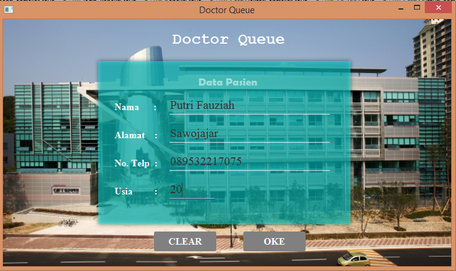
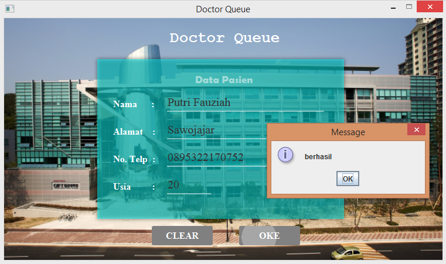
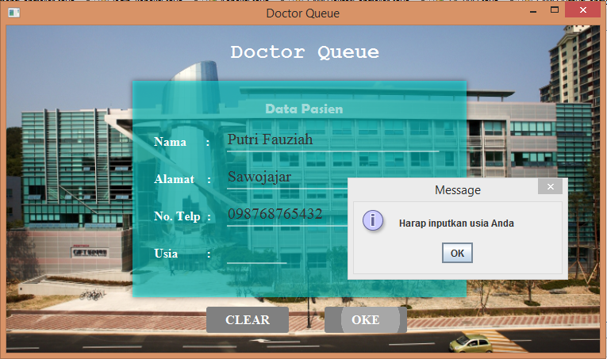
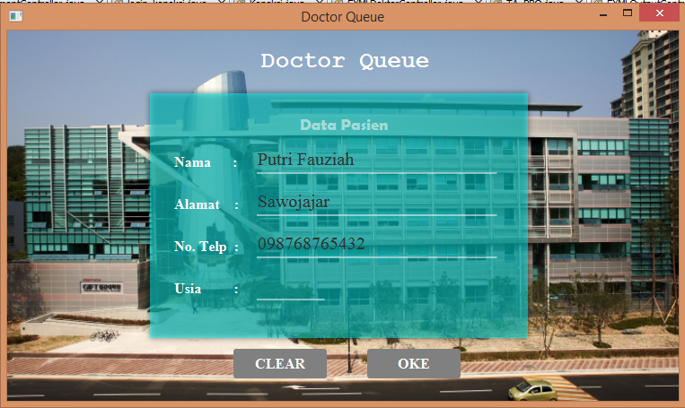
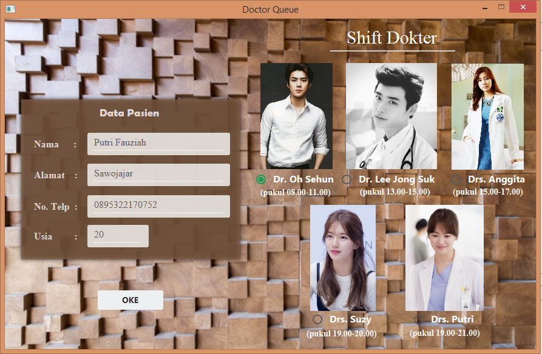
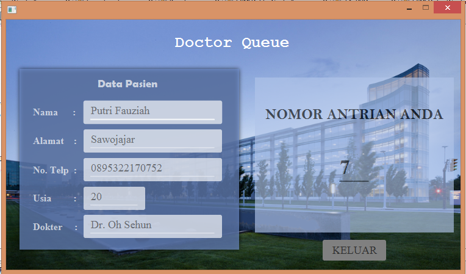

# DoctorQueue

Doctor Queue adalah aplikasi desktop yang digunakan untuk memudahkan para pasien mendapatkan nomer antrian. Terkadang banyak pasien yang mengeluh karena mereka sudah lama-lama menunggu nomor antrian mereka dipanggil ataupun yang sudah menunggu lama tetapi tidak mendapatkan nomor antrian.

Ketika program Doctor Queue dijalankan, maka tampilan yang akan keluar adalah seperti gambar di bawah ini.

Selanjutnya kita bisa mendaftarkan diri kita untuk mendapatkan nomer antrian.

Apabila kita menginputkan data diri kita dengan lengkap maka kita akan diarahkan pada tampilan selanjutnya yaitu tampilan pemilihan dokter.Namun, apabila kita tidak menginputkan data diri dengan lengkap maka akan keluar notifikasi seperti berikut

Dan kita tidak akan diarahkan pada halaman selanjutnya melainkan tetap pada halaman awal untuk melengkapi data yang kosong.

Pada tampilan dokter, data diri kita akan ditampilkan kembali. Selain itu, pada halaman ini kita bisa memilih dokter yang kita inginkan bahkan terdapat informasi shift dokter tersebut.

Setelah button OKE kita klik, maka kita akan diarahkan pada halamn output atau halaman terakhir dimana kita akan mendapatkan nomer antrian kita.

